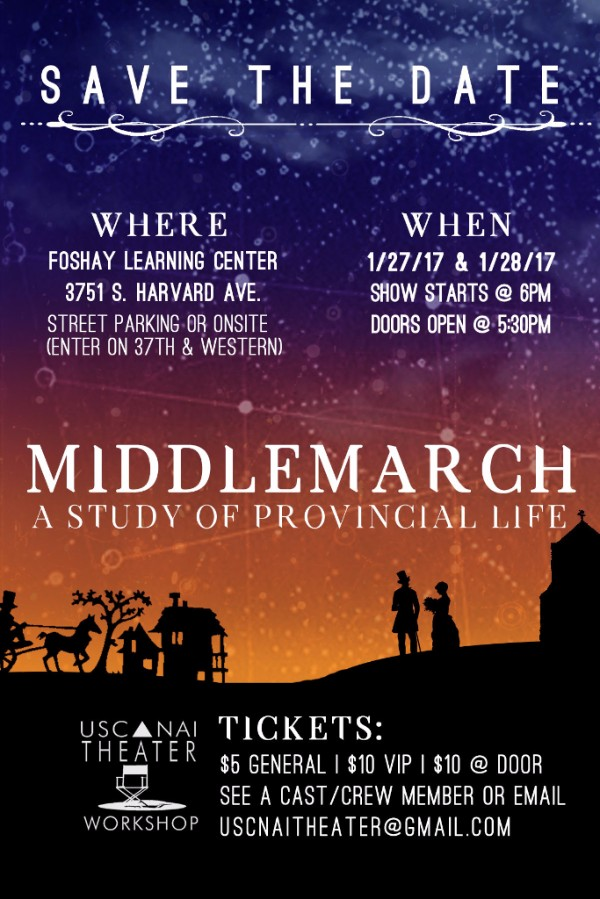
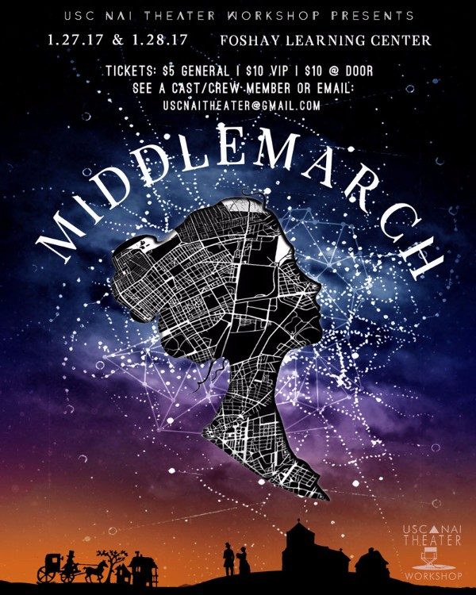
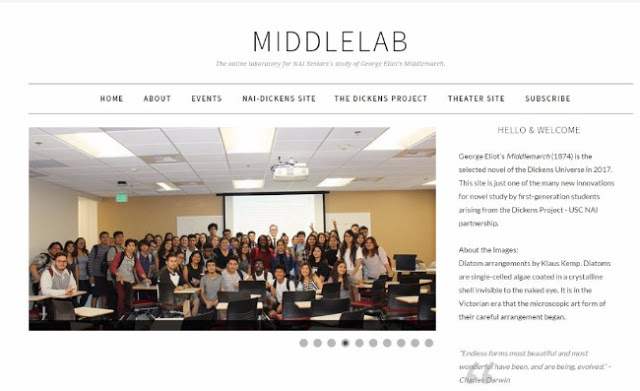

<h2 style="font-family: &quot;playfair display&quot;; font-size: 26px; font-weight: normal; letter-spacing: -0.75px; line-height: 32.5px; margin: 0px; padding: 0px; text-align: center;">
<em style="margin: 0px; padding: 0px;">I should like to make life beautiful.</em></h2>

 

<h4 style="font-weight: normal; line-height: 15px; margin: 0px; padding: 0px; text-align: center;">
-Dorothea Brooke,&nbsp;<em style="margin: 0px; padding: 0px;">Middlemarch</em></h4>

<em style="margin: 0px; padding: 0px;"> </em>

<em style="margin: 0px; padding: 0px;">USC NAI Theater Workshop invites you to an original production of George Eliot’s&nbsp;<em style="color: #43404d; ">Middlemarch&nbsp;</em>directed by Jacqueline Jean Barrios and Paul David Story. A rare company of South Los Angeles teens brings the 19th century novel to life on the Foshay stage for two nights,&nbsp;January 27&nbsp;Friday and&nbsp;January 28&nbsp;Saturday. The performances, featuring scenes and movement inspired by the literature, will culminate MiddleLab, a year-long study of the novel in the NAI seniors’ AP English Literature classroom in collaboration with the Dickens Project.&nbsp;</em> 
 

Design by Kenia Coyoy

 

<em style="margin: 0px; padding: 0px;"><strong style="color: #43404d;  font-style: normal;">George Eliot’s&nbsp;<em>Middlemarch, A Study of Provincial Life (1872)</em></strong> In the fictional town of Middlemarch, an English town on the brink of modernity, Dorothea Brooke is on a quest for intellectual passion and social reform through marriage to the Reverend Edward Casaubon, a man twice her age. Tertius Lydgate, a young doctor seeking to revolutionize medicine, falls in love with the town beauty, Rosamond Vincy. The arrival of the young, passionate Will Ladislaw entangles Middlemarchers even more closely in a web of gossip, secrets and love.</em>

<em style="margin: 0px; padding: 0px;"> </em>

Poster by Kenia Coyoy

<em style="margin: 0px; padding: 0px;"><strong style="color: #43404d;  font-style: normal;"> </strong></em>
<em style="margin: 0px; padding: 0px;"><strong style="color: #43404d;  font-style: normal;">MiddleLab Festival:</strong> Join us for tea! Relive the manners of an English provincial town in your 19th century costume. Meet the scholars and discuss the novel’s characters and topics: the entanglement of lives lived in community, the complexity of marriage and gender expectations, the quest for knowledge and truth. The Festival will feature student designed interactive activities, talks, a “Petri-Dish” art exhibit and guest scholars from the Dickens Project. The Festival runs from 8-12AM&nbsp;at the Miami Room, Foshay Learning Center. Details coming soon on our blog:&nbsp;<a data-saferedirecturl="https://www.google.com/url?hl=en&amp;q=http://middlelab.blogspot.com&amp;source=gmail&amp;ust=1484087615054000&amp;usg=AFQjCNHFhyouJ9AhTWjcgSwiao_coR3mCA" href="http://middlelab.blogspot.com/" style="color: #a50404;  font-style: normal; text-size-adjust: 100%;" target="_blank" wotsearchprocessed="true">middlelab.blogspot.com</a></em>

 

<a data-saferedirecturl="https://www.google.com/url?hl=en&amp;q=http://middlelab.blogspot.com&amp;source=gmail&amp;ust=1484087615054000&amp;usg=AFQjCNHFhyouJ9AhTWjcgSwiao_coR3mCA" href="http://middlelab.blogspot.com/" style="color: #a50404;  text-size-adjust: 100%;" target="_blank" wotsearchprocessed="true"><strong>MiddleLab</strong>&nbsp;</a>&nbsp;is a laboratory for innovation in novel study, a collaboration between the USC Neighborhood Academic Initiative (NAI) and the Dickens Project. The partnership has featured projects with university faculty and students, classroom swaps, field trips, visual and performing arts adaptations, guest scholars and advanced literary intensives. The Production and Festival are the highlight events in a year-long study of Eliot’s novel, the annual selection for the Dickens Universe conference held at UC Santa Cruz. In addition to bringing the work to life for their community this winter, students are penning essays for submission to a scholarship contest to represent their community at conference&nbsp; in the summer of 2017. 
 
<a data-saferedirecturl="https://www.google.com/url?hl=en&amp;q=http://uscnai.wix.com/webs&amp;source=gmail&amp;ust=1484087615054000&amp;usg=AFQjCNHGVceC7L1UcOrZwQj8t3o5yiNeyA" href="http://uscnaitheater.me/" style="color: #a50404;  text-size-adjust: 100%;" target="_blank" wotsearchprocessed="true"><strong>USC NAI Theater Workshop</strong></a><strong style="color: #43404d; ">&nbsp;</strong>under the direction of Jacqueline Barrios and Paul David Story, aims to grow south LA students’ study of literature through the performing arts.&nbsp; The workshop seeks to go beyond the limits of a traditional classroom to inspire a love of literature and learning. &nbsp; 
 
<a data-saferedirecturl="https://www.google.com/url?hl=en&amp;q=https://communities.usc.edu/college-access/nai/&amp;source=gmail&amp;ust=1484191588984000&amp;usg=AFQjCNGk5SQtNt0wSxiPFUxjk-nD47o4rQ" href="https://communities.usc.edu/college-access/nai/" style="color: #a50404;  text-size-adjust: 100%;" target="_blank" wotsearchprocessed="true"><strong>USC’s Neighborhood Academic Initiative (NAI)</strong></a>&nbsp;is a rigorous, seven-year pre-college enrichment program designed to prepare low-income neighborhood students for admission to a college or university. Those who complete the program, meet USC’s competitive admission requirements, and choose to attend USC are rewarded with a full 4.5-year financial package, minus loans.&nbsp; 
 
<a data-saferedirecturl="https://www.google.com/url?hl=en&amp;q=http://dickens.ucsc.edu/&amp;source=gmail&amp;ust=1484087615054000&amp;usg=AFQjCNHS2tm1fkNytMoEAkV2EjxVxgTmfg" href="http://dickens.ucsc.edu/" style="color: #a50404;  text-size-adjust: 100%;" target="_blank" wotsearchprocessed="true"><strong>Dickens Project.&nbsp;</strong></a>Founded in 1981 and headquartered at UC Santa Cruz, the Dickens Project is a research consortium of faculty and graduate students from major American and international universities. Member institutions include the University of Southern California, all the UC campuses, Stanford, Princeton, Yale, and NYU, among others.
